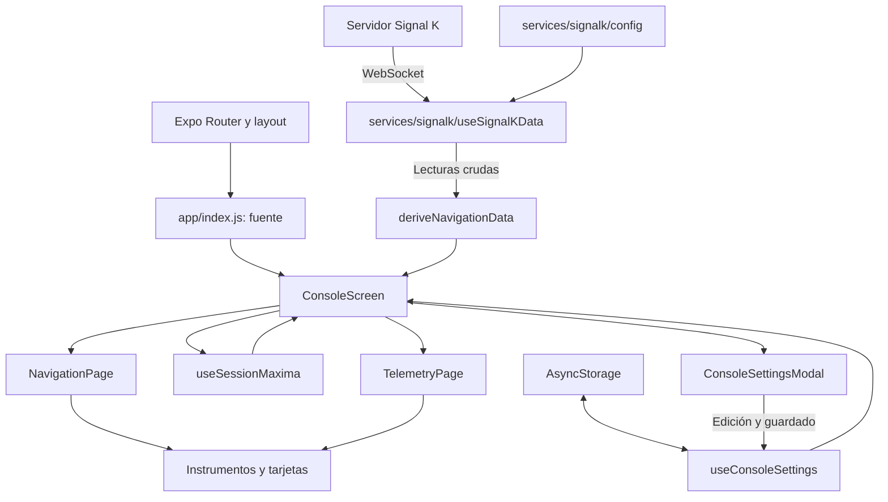

# Arquitectura de app-nav-marina

Guía de la estructura reorganizada el 22/09/2026. La aplicación es una consola React Native/Expo que recibe telemetría de un servidor Signal K externo. El servidor y su simulador no se ejecutan dentro de esta app.

## 1. Por dónde empezar a leer

1. [app/index.js](app/index.js): carga la fuente y monta la consola.
2. [ConsoleScreen.js](features/console/ConsoleScreen.js): coordina datos, ajustes y páginas.
3. [NavigationPage.js](features/console/screens/NavigationPage.js): primera página, navegación.
4. [TelemetryPage.js](features/console/screens/TelemetryPage.js): segunda página, instrumentos.
5. [navigationData.js](features/console/model/navigationData.js): conversiones y fórmulas.
6. [useSignalKData.js](services/signalk/useSignalKData.js): conexión y recepción.

El antiguo `SignalKConnector.js` exporta `ConsoleScreen` para mantener compatibles las importaciones anteriores. El `useSignalKData.js` de la raíz también es una exportación de compatibilidad.

## 2. Árbol y responsabilidades

```text
app/                              Rutas, arranque y pantallas de plantilla
  index.js                        Carga de fuente y entrada a la consola
  _layout.tsx                     Navegación y tema del sistema
features/console/                 Funcionalidad de la consola náutica
  ConsoleScreen.js                Composición y estado visual
  screens/
    NavigationPage.js             Rumbo, viento, profundidad y máximos
    TelemetryPage.js              SOG, modo vela/motor y panel de instrumentos
  components/
    ConsolePage.js                Marco, textura y scroll compartidos
    ConnectionHeader.js           Conexión y botón opcional de ajustes
    ConsoleSettingsModal.js       Controles de configuración
  hooks/
    useConsoleSettings.js         Carga, edición y guardado de ajustes
    useSessionMaxima.js            Máximos SOG/TWS y acciones de reinicio
  model/
    navigationData.js             Funciones de conversión y rendimiento
    autopilot.js                  Etiqueta y color del piloto
    settings.js                   Valores iniciales y clave de almacenamiento
  styles/
    consoleStyles.js              Distribución de las páginas
    consoleTheme.js               Colores y estado visual de ceñida
    settingsStyles.js             Estilos del modal
services/signalk/
  config.js                       Host, URL y catálogo de paths iniciales
  useSignalKData.js                WebSocket y estado de lecturas
components/                       Instrumentos y piezas reutilizables
  gauges/                         Indicadores SVG
  gauges/shared/                  Definiciones SVG y geometría común
  icons/                          Iconos de vela y motor
hooks/                            Media del viento y hooks de tema
utils/Utils.js                    Unidades, ángulos e interpolación
styles/GaugeTheme.js               Tema común de instrumentos
constants/theme.ts                Tema de la plantilla Expo
assets/                           Imágenes, textura y tipografía
tests/navigation.test.mjs          Pruebas de cálculos y contrato del simulador
```

Las páginas usan componentes visuales; `ConsoleScreen` conecta páginas con hooks y funciones de cálculo; los instrumentos no conocen WebSocket ni AsyncStorage.

## 3. Flujo de ejecución



Al montar `ConsoleScreen`, el hook abre la conexión, el hook de ajustes inicia la carga local y React dibuja los valores iniciales. Cuando llegan datos, el hook actualiza su estado; `ConsoleScreen` recalcula `navigation` mediante `useMemo` y pasa el resultado a las páginas. Después del renderizado, `useSessionMaxima` comprueba los máximos.

Ambas páginas se montan en un `ScrollView` horizontal con paginación. Las antiguas funciones `renderMainConsole` y `renderTelemetryDetails` se han sustituido por componentes React con nombre. No se ejecutan solo al deslizar: reciben actualizaciones de su componente padre.

## 4. Entrada y rutas

[package.json](package.json) utiliza `expo-router/entry`. [app/_layout.tsx](app/_layout.tsx) configura el Stack, el tema del sistema y las rutas de ejemplo. [app/index.js](app/index.js) carga `NauticalFont`; un efecto oculta el splash cuando la fuente está lista y se muestra `ConsoleScreen`.

Se conservan las pestañas Home/Explore en `app/(tabs)` y el modal de ejemplo. No son las dos páginas náuticas ni el modal de ajustes. El layout conserva el anchor `(tabs)`. La exportación web genera tanto `/` como `/(tabs)`; el comportamiento de entrada en dispositivos debe verificarse en el entorno correspondiente.

Los componentes `themed-text`, `themed-view`, `parallax-scroll-view`, `hello-wave`, `external-link`, `haptic-tab` y `ui` sirven principalmente a esa plantilla, separada de `features/console`.

## 5. Transporte y catálogo Signal K

[config.js](services/signalk/config.js) reúne `SIGNALK_IP`, `SOCKET_URL` e `INITIAL_DATA`. La URL actual es `ws://openplotter.local:3000/signalk/v1/stream`.

`INITIAL_DATA` contiene 12 paths y el estado local `isConnected`. Las lecturas numéricas comienzan a cero y el piloto en `standby`. El hook se suscribe al contexto `vessels.self`, formato delta, solicitando un periodo de 500 ms.

La recepción conserva el comportamiento anterior: interpreta JSON, lee `updates[0].values`, filtra según `INITIAL_DATA` y mezcla las lecturas aceptadas con el estado. En cierre o error marca `isConnected` como false. No envía órdenes a instrumentos o al piloto.

El inventario completo está en [SIGNALK-SIMULADOR.md](SIGNALK-SIMULADOR.md). [simulator.json](simulator.json) configura las 11 entradas numéricas del plugin externo. El estado del piloto requiere texto y se explica aparte.

## 6. Modelo: cálculos sin interfaz

`deriveNavigationData` recibe un diccionario de paths y devuelve datos preparados. No usa React, red ni almacenamiento, por lo que se puede probar de forma independiente.

| Dato preparado | Transformación existente |
| --- | --- |
| SOG, TWS y corriente | m/s a nudos |
| Rumbo, viento, timón y escora | Radianes a grados |
| RPM | Revoluciones/s multiplicadas por 60 |
| twaCog | Rumbo menos dirección del viento, normalizado |
| twa | Negativo de twaCog |
| Modo | SAIL o ENGINE según el umbral de RPM existente |
| Textos | Redondeo de rumbo y ángulo aparente |

`derivePerformance` prepara VMC = SOG × cos(twaCog), VMG = valor absoluto de VMC y objetivo VMG = máximo SOG × cos(ceñida mínima). Convierte grados a radianes antes del coseno. No utiliza polares ni waypoint.

`mpsToKnots` sigue devolviendo un texto con un decimal. [autopilot.js](features/console/model/autopilot.js) traduce `auto`, `wind`, `route` y el estado por defecto a AUTO, WIND, TRACK y STBY.

## 7. Composición y presentación

`ConsoleScreen` obtiene dimensiones, lecturas, ajustes y máximos. Mantiene como estados visuales propios la apertura del modal y el modo nocturno. Construye la paleta y entrega datos y callbacks a sus hijos.

| Componente | Responsabilidad |
| --- | --- |
| NavigationPage | Rumbo, corriente, viento, máximos, piloto, COG, profundidad y AWA |
| TelemetryPage | Velocímetro, modo de navegación, panel secundario y VMC |
| ConsolePage | Marco con textura CarbonFiber y scroll vertical |
| ConnectionHeader | Conexión y acceso opcional a ajustes |
| ConsoleSettingsModal | Sliders y switch; comunica acciones sin acceder al almacenamiento |
| DataSquare | Valor, etiqueta, gráfica y barra opcionales |
| InfoPanel | Resumen de máximos y piloto |
| HeadingGauge | Esfera de rumbo, viento, corriente y ceñida |
| SOGGauge | Velocímetro con aguja suavizada |
| NavigationMode | Iconos de vela/motor |
| ControlPanelBase | Marco del panel secundario |
| SailDataOverlay | Timón, VMG, rolada y escora |
| RudderGauge / HeelGauge | Timón / escora y alertas |
| VMGNavigator / WindShiftGauge | Rendimiento / diferencia del viento respecto a su media |
| VesselGaugeFrame | Marco SVG de instrumentos pequeños |

HeadingGauge y SOGGauge suavizan movimientos con `requestAnimationFrame`. DataSquare mantiene hasta 40 cambios de valor: su gráfica no representa un intervalo temporal fijo. Pulsar SOG/TWS limpia el historial y solicita reiniciar el máximo.

GaugeTheme y GaugeDefs proporcionan colores y degradados. `consoleTheme` controla la paleta de consola y el indicador de ceñida. El modo nocturno propio y el tema del sistema de la plantilla siguen siendo independientes.

StaticGauge y DataField son piezas auxiliares sin uso en la consola actual. DataField dispone ahora de importaciones, estilos y exportación válidos.

## 8. Estado y persistencia

| Estado | Responsable | Persistente |
| --- | --- | --- |
| Lecturas y conexión | useSignalKData | No |
| Máximos SOG/TWS | useSessionMaxima | No |
| Ajustes | useConsoleSettings | Sí, AsyncStorage |
| Modal y modo nocturno | ConsoleScreen | No |
| Historial | DataSquare | No |
| Media del viento | useWindTactic | No |

[settings.js](features/console/model/settings.js) mantiene la clave `@ajustes_consola` y las claves originales `minAnguloCeñida`, `maxAnguloCeñida` y `rudderLimit`, inicialmente 20, 60 y 35. Esto conserva la configuración existente.

`useConsoleSettings` carga los ajustes, mezcla los guardados con los iniciales y expone `updateSetting` y `saveSetting`. Los sliders actualizan durante el arrastre y guardan al soltar. Los fallos de almacenamiento se registran en consola.

`useSessionMaxima` usa actualizaciones funcionales. Reiniciar un máximo lo deja a cero hasta que cambian las lecturas observadas, como antes.

`useWindTactic` calcula una media circular con senos y cosenos. Cinco minutos equivalen a 300 muestras suponiendo 1 Hz; no conserva tiempos reales.

## 9. Compatibilidad y limitaciones pendientes

Se conservan paths, fórmulas, límites, textos, ajustes guardados y las dos páginas. Además se incorpora manejo de errores de almacenamiento, cierre del modal mediante la acción nativa y cierre del splash desde un efecto. Se han corregido problemas de lint en componentes auxiliares.

Limitaciones funcionales previas que permanecen:

- COG se alimenta de `headingTrue`.
- Profundidad y escora dependen de los paths particulares de la guía del simulador.
- Los paths alternativos de corriente no se suscriben y los ceros principales impiden seleccionarlos con `??`.
- ENGINE requiere más de 666661 RPM.
- TelemetryPage no pasa `twd` a SailDataOverlay; la rolada no recibe dirección real. También queda normalizar su diferencia al cruzar el norte.
- Un objetivo VMG de cero puede causar una división no válida en VMGNavigator.
- El hook procesa solo la primera actualización, no valida mensajes ni incluye reconexión o caducidad de lecturas.
- Las rutas de plantilla permanecen disponibles.

## 10. Dónde realizar cada cambio

| Necesidad | Lugar |
| --- | --- |
| Servidor o paths | services/signalk/config.js |
| Recepción o reconexión | services/signalk/useSignalKData.js |
| Cálculo náutico | features/console/model/navigationData.js |
| Página principal | features/console/screens/NavigationPage.js |
| Telemetría | features/console/screens/TelemetryPage.js |
| Nuevo ajuste | model/settings.js, useConsoleSettings y ConsoleSettingsModal |
| Máximos | features/console/hooks/useSessionMaxima.js |
| Marco y distribución | ConsolePage y consoleStyles |
| Instrumento | components/gauges/ |
| Arranque | app/index.js y app/_layout.tsx |

Para añadir una lectura: registrar el path, convertirlo en el modelo, pasarlo al instrumento desde la página y actualizar guía y simulación. Los componentes reciben datos mediante props y acciones mediante callbacks.

## 11. Desarrollo y validación

Versiones declaradas: Expo ~54.0.29, React Native 0.81.5 y React 19.1.0. La consola usa JS/JSX; las rutas de plantilla incluyen TS/TSX. tsconfig.json activa modo estricto para TS/TSX y el alias `@/*`.

```bash
npm run start
npm run android
npm run ios
npm run web
npm run lint
npm test
npx expo export --platform web --output-dir dist
```

Los comandos de plataforma son alternativas. Las pruebas utilizan `node:test` y la detección ESM de Node moderno; se han ejecutado con Node 24 sin instalar librerías adicionales.

Se comprueban conversiones, signos, cruce del norte, rendimiento, ajustes, piloto y cobertura del simulador. También se compararon temporalmente 100 escenarios con los cálculos anteriores. El lint y la exportación web verifican el código y el empaquetado; no sustituyen una prueba visual en dispositivo ni una conexión al servidor real.

El script `reset-project` pertenece a la plantilla y mueve o elimina carpetas de código. No sirve para reiniciar normalmente la consola.
