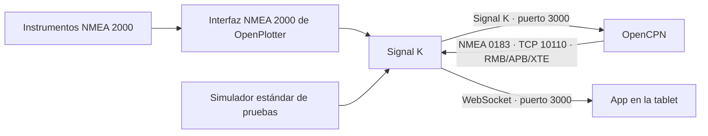

# Instalación y configuración: OpenCPN, OpenPlotter, Signal K y la app

Guía para la instalación probada con OpenPlotter 4 y OpenCPN 5.14.
Última revisión: 27 de septiembre de 2026.

## 1. Qué hace cada parte



La app se conecta a Signal K, no directamente a OpenCPN. Los instrumentos y AIS
pueden funcionar sin OpenCPN. OpenCPN aporta el destino y los datos del tramo
activo cuando se utiliza como programa de navegación.

Signal K convierte las entradas NMEA 0183 y NMEA 2000 a su modelo común.
[Funcionamiento de OpenPlotter](https://openplotter.readthedocs.io/latest/description/how_does_it_work.html).

## 2. Estado actual del proyecto

| Función | Estado |
|---|---|
| GPS, viento, SOG, rumbo, COG, profundidad, timón y escora | Lectura estándar implementada |
| Corriente, motor y estado del piloto | Implementado; necesita los datos correspondientes |
| AIS y ficha del barco al pulsarlo | Implementado; necesita posición propia y contactos recientes |
| Historial TWS/SOG, alarma de profundidad e idiomas | Implementado en la app |
| OpenCPN enviando destino a Signal K | Verificado en esta instalación |
| Panel de waypoint mostrando el destino real | Implementado para destinos recibidos por courseRhumbline/courseGreatCircle |
| Lectura de ruta completa y cambios entre todos sus puntos | Pendiente de integración |
| Controlar físicamente el piloto automático | No implementado; solo se visualiza su estado |

Configurar OpenCPN no sustituye las funciones pendientes de desarrollo.

## 3. Preparar OpenPlotter y la red

1. En OpenPlotter, comprueba que están instalados Signal K y OpenCPN. Si faltan,
   utiliza las herramientas de instalación de OpenPlotter para cada aplicación.
2. Abre Signal K en el navegador de OpenPlotter: `http://localhost:3000`.
3. Conecta la tablet y, si usas Expo, el PC de desarrollo a una red que permita
   comunicarse con OpenPlotter.
4. Desde la tablet abre `http://openplotter.local:3000`. Si el nombre no resuelve,
   usa la IP de OpenPlotter, por ejemplo `http://192.168.1.50:3000`.
   Esa IP es ilustrativa: sustitúyela por la de tu equipo.

El puerto predeterminado del instalador de Signal K es 3000.
[Signal K Installer](https://openplotter.readthedocs.io/4.x.x/signalk/signalk_app.html).

| Dónde configuras la dirección | Dirección del servidor |
|---|---|
| OpenCPN ejecutándose en el mismo OpenPlotter | `127.0.0.1` |
| OpenCPN en otro ordenador | IP o nombre de OpenPlotter |
| Nuestra app en la tablet | `http://openplotter.local:3000` o IP equivalente |

`localhost` en la tablet significa la propia tablet: no lo uses para acceder a
Signal K instalado en OpenPlotter. Si modificas los puertos del servidor, adapta
todas las conexiones de esta guía.

## 4. Elegir los datos: simulación o instrumentos reales

### A. Pruebas con el simulador estándar

1. Copia y extrae [signalk-standard-demo.zip](simulation/signalk-standard-demo.zip)
   en la carpeta personal del usuario de OpenPlotter.
2. Comprueba que existe `~/signalk-standard-demo/package.json`.
3. En una terminal de OpenPlotter, como el usuario del servicio Signal K:

   ```bash
   cd ~/.signalk
   npm install "$HOME/signalk-standard-demo"
   ```

   Ajusta `~/.signalk` si el servicio utiliza otro directorio de configuración.
4. Desactiva en Plugin Config el antiguo simulador numérico y el puente
   **GPS Demo - posicion para OpenCPN**, si lo instalaste. Guarda.
5. Reinicia Signal K y activa **Standard Demo - instrumentos Signal K**.
6. Para AIS, instala del mismo modo la carpeta `simulation/signalk-ais-demo`
   y activa **AIS Demo - cuatro barcos simulados**. Si ya funciona, consérvala.

El simulador estándar, con sus valores sintéticos de viento real, no necesita el
puente GPS ni plugins de cálculo. Para probar el cálculo de viento real con
Derived Data, utiliza la configuración del apartado 4.C y evita publicar las
mismas salidas desde ambos plugins.
La posición es fija en Canarias, cerca de los contactos AIS de prueba. SOG, COG,
viento y otros instrumentos son sintéticos: no representan una trayectoria física.
No crea ni activa un waypoint.

Para probar alarmas, configura profundidad mínima 1 y máxima 5 m y un umbral de
3 m en la app. Para ENGINE, configura 1800 RPM; para SAIL, 0 RPM. Puedes seleccionar
el estado del piloto en el plugin sin enviar órdenes a un equipo real.

Más detalles: [manual del simulador](simulation/signalk-standard-demo/README.md).

### B. Instrumentos NMEA 2000 reales

1. Desactiva todos los emisores de simulación, incluido AIS.
2. Configura la interfaz compatible con tu red en OpenPlotter. El procedimiento
   depende del adaptador: CAN o convertidor USB, entre otros.
3. Comprueba en Signal K **Data Browser** que llegan valores del barco propio con
   su fuente y fecha de actualización.
4. Si dos dispositivos publican el mismo dato, revisa la selección de fuentes.
5. Viento real, corriente o rumbo verdadero pueden necesitar cálculos adicionales
   si los equipos no los publican. No instales el puente de simulación para suplirlos.

Referencias: [CAN Bus de OpenPlotter](https://openplotter.readthedocs.io/latest/can/can_app.html)
y [datos derivados de Signal K](https://github.com/SignalK/signalk-derived-data).

### C. Calcular TWA y TWS con Derived Data

Utiliza este paso cuando Signal K recibe viento aparente pero no viento real.
Que un Triton o un plotter muestre TWA/TWS no garantiza que esos valores lleguen
a Signal K. Comprueba primero los paths del barco propio en **Data Browser**.

1. En **App Store**, busca e instala `signalk-derived-data` si todavía no está
   instalado. Reinicia Signal K si la interfaz lo solicita.
2. En **Server → Plugin Config**, abre **Derived Data** y marca **Enabled**.
3. En el apartado **Wind**, activa **True Wind Angle and Speed**. Esta opción
   utiliza velocidad respecto al agua (STW), no velocidad GPS (SOG).
4. Guarda con **Submit / Save**.
5. Comprueba que las tres entradas siguientes tienen valores numéricos y se
   actualizan de forma continua:

   | Entrada | Path | Unidad de Signal K |
   |---|---|---|
   | Ángulo de viento aparente | `environment.wind.angleApparent` | Radianes |
   | Velocidad de viento aparente | `environment.wind.speedApparent` | m/s |
   | Velocidad respecto al agua | `navigation.speedThroughWater` | m/s |

6. En **Data Browser**, selecciona **self** y busca `wind`. Verifica que Derived
   Data genera `environment.wind.angleTrueWater` (TWA, radianes) y
   `environment.wind.speedTrue` (TWS, m/s), con valores y fechas recientes.
7. Compara esos datos con la app: convierte radianes a grados y m/s a nudos.
   La app ya se suscribe a estos paths y hace las conversiones; no requiere
   cambiar el código ni generar otra APK para activar este cálculo.

No es necesario activar los cálculos de dirección del viento ni de viento
respecto al suelo para obtener TWA/TWS con esta opción. STW igual a cero es una
entrada válida cuando el barco está parado; si permanece a cero navegando,
revisa la corredera. Una entrada ausente no equivale a cero.

**Prueba en el servidor local:** configura un emisor de simulación para publicar
periódicamente `angleApparent = 0.5`, `speedApparent = 5` y
`navigation.speedThroughWater = 3`, con los paths completos de la tabla.
Desactiva la publicación simulada de `environment.wind.angleTrueWater` y
`environment.wind.speedTrue` para que solo Derived Data genere esas salidas.
Si el simulador no permite desactivar campos individualmente, adapta su
configuración o utiliza un emisor que publique únicamente las entradas necesarias.
El resultado esperado es aproximadamente **TWA 59,93°** y **TWS 5,38 kn**.

**Despliegue en el barco:** instala y configura Derived Data también en el
servidor Signal K de OpenPlotter. El plugin y su configuración no se incluyen
en la APK ni en el paquete web. Desactiva los simuladores; el sensor de viento
y la corredera proporcionarán las entradas reales. Si la red ya publica viento
real, revisa las fuentes antes de habilitar otro cálculo para los mismos paths.

[Cálculo y paths de Derived Data](https://github.com/SignalK/signalk-derived-data/blob/master/src/calcs/windDirection.ts).

## 5. Entrada de Signal K en OpenCPN

En **Options → Connections → Add new connection**:

| Campo | Valor |
|---|---|
| Tipo | Network |
| Protocolo | Signal K |
| Dirección | `localhost` o `127.0.0.1` si comparten equipo |
| Puerto | `3000` |
| Dirección de datos | Entrada |
| Habilitada | Sí |

Guarda. Si ya tienes esta conexión, edítala o compruébala; no crees otra idéntica.
Deberías ver la posición propia en la carta y recibir los instrumentos disponibles.

Antes de probar destinos, abre:
`http://openplotter.local:3000/signalk/v1/api/vessels/self/navigation/position`

El resultado debe contener `value.latitude`, `value.longitude` y una fecha reciente.
No basta con que existan `simulation.gps.latitude` y `simulation.gps.longitude`.

[Configuración Signal K en OpenCPN](https://opencpn.org/wiki/dokuwiki/doku.php?id=opencpn%3Amanual_basic%3Aset_options%3Aconnections%3Asingnalk).

## 6. Habilitar la entrada de navegación en Signal K

En la administración de Signal K, entra en **Server → Data Connections → Add**:

| Campo | Valor |
|---|---|
| Enabled | Activado |
| ID | `opencpn_navigation`, o un identificador único |
| Data Type | `NMEA 0183` |
| NMEA 0183 source | `TCP Server on port 10110` |

Guarda y reinicia si la interfaz lo solicita. Si ya existe esta entrada, reutilízala.
Esta selección habilita recepción en el servidor TCP 10110 existente de Signal K;
no necesitas crear otro proceso que escuche en el mismo puerto.
[Multiplexación de OpenPlotter](https://openplotter.readthedocs.io/4.x.x/signalk/multiplexing.html).

## 7. Salida de navegación de OpenCPN

Crea una segunda conexión en **Options → Connections**:

| Campo | Valor |
|---|---|
| Tipo | Network |
| Network Protocol | TCP |
| Data Protocol | NMEA 0183 |
| Address | `127.0.0.1` si Signal K está en el mismo equipo |
| DataPort | `10110` |
| Receive Input on this Port | Desmarcado |
| Output on this port | Marcado |
| Advanced → Output filtering | Transmit sentences |
| Sentencias | `APB,RMB,XTE` |

Guarda y **cierra Opciones**. Deben quedar dos conexiones: entrada Signal K en
3000 y salida NMEA 0183 en 10110. El filtro limita la salida a navegación; no
marques la recepción en esta segunda conexión si ya recibes los instrumentos por Signal K.

OpenCPN genera datos para el tramo activo. Mantener abierta la ventana Opciones
puede detener la salida de navegación durante la prueba.
[Salida hacia piloto en OpenCPN](https://opencpn.org/wiki/dokuwiki/doku.php?id=opencpn%3Amanual_basic%3Acreate_routes%3Aroute_autopilot).

## 8. Activar un destino y comprobar la llegada

1. En la carta, crea o selecciona un waypoint próximo a la posición propia.
2. Selecciona **Navegar hacia / Navigate to** en su menú contextual. También puedes
   activar una ruta: el dato relevante será su siguiente waypoint.
3. Cierra Opciones si estaba abierta.
4. En OpenCPN 5.14 abre **Tools → Data Monitor**. Busca salida por la conexión
   10110 con mensajes como `$ECRMB`, `$ECAPB` y `$ECXTE`.
   El prefijo del emisor puede variar; identifica la sentencia RMB/APB/XTE.
5. En Signal K Data Browser busca los siguientes paths del barco propio:

   ```text
   navigation.courseRhumbline.nextPoint.position
   navigation.courseRhumbline.nextPoint.distance
   navigation.courseRhumbline.nextPoint.bearingTrue
   navigation.courseRhumbline.nextPoint.ID
   navigation.courseRhumbline.crossTrackError
   ```

También pueden aparecer datos bajo `navigation.courseGreatCircle`. Comprueba
valores, fuente y actualizaciones; un valor retenido no demuestra navegación activa.

Consultas útiles desde el navegador:

- `http://openplotter.local:3000/signalk/v1/api/vessels/self/navigation/courseRhumbline`
- `http://openplotter.local:3000/signalk/v1/api/vessels/self/navigation/courseGreatCircle`
- `http://openplotter.local:3000/signalk/v2/api/vessels/self/navigation/course`

La API v2 depende de la versión y configuración del servidor. Un `activeRoute: null`
no descarta un destino directo: revisa también `nextPoint`. Los nombres de waypoint
o la ruta completa no están garantizados por recibir el próximo destino.
[Course API de Signal K](https://github.com/SignalK/signalk-server/blob/master/docs/develop/rest-api/course_api.md).

Después cancela la navegación en OpenCPN y comprueba si las lecturas se invalidan
o dejan de actualizarse. El panel se oculta ante posición de destino nula o tras 30 segundos sin actualizaciones de navegación.

En la prueba realizada en este proyecto se recibieron RMB, APB y XTE con fuente
`opencpn_navigatio.EC` y destino `002`. Son valores observados, no nombres que debas configurar.

## 9. Conectar nuestra app

En **Settings / Configuración**, guarda la dirección base de Signal K:

```text
http://openplotter.local:3000
```

Usa la IP si el nombre no resuelve. La app construye la dirección WebSocket.
No introduzcas el puerto NMEA 0183 10110 como servidor de la app.

Para el proyecto de desarrollo actual, instala sus dependencias en el PC con
`npm install` y arranca Metro con `npx expo start --clear`. Abre el proyecto en
una instalación de Expo Go compatible con el SDK 54 que utiliza el proyecto.
El QR conecta la tablet al PC para cargar la app; la dirección de Settings conecta
la app con OpenPlotter para recibir datos. Son dos conexiones distintas.

Si Signal K exige autenticación para leer los datos, esta versión de la app aún
no incorpora una entrada de token: necesita integrar ese mecanismo para esa instalación.

## 10. Comprobación por instrumento

| Indicador | Dato necesario en Signal K |
|---|---|
| GPS | `navigation.position` como objeto |
| Rumbo del gauge/compás | `navigation.headingTrue`, o magnético más variación |
| COG | `navigation.courseOverGroundTrue` |
| SOG | `navigation.speedOverGround` |
| Profundidad | `environment.depth.belowTransducer` |
| Escora | `navigation.attitude`, propiedad `roll` |
| Corriente | `environment.current`, propiedades `drift` y `setTrue` |
| Viento aparente | `environment.wind.angleApparent` y `speedApparent` |
| Viento real | `environment.wind.speedTrue`, dirección verdadera o ángulo verdadero |
| Timón | `steering.rudderAngle` |
| Motor | `propulsion.<identificador>.revolutions` |
| Piloto | `steering.autopilot.state` |
| AIS | Otros contextos `vessels.<identificador>` con `navigation.position` |

Signal K utiliza metros, m/s, radianes y Hz para estos instrumentos. La app convierte
a nudos, grados y RPM. Profundidad bajo transductor no equivale a profundidad bajo
quilla. La app no debe mostrar una como si fuera la otra.
[Referencia de paths](https://signalk.org/specification/1.7.0/doc/vesselsBranch.html).

El botón AIS DATA cambia la visibilidad; la recepción sigue activa. Para situar
barcos dentro del gauge hace falta posición propia reciente y contactos dentro
del radio de seis millas.

## 11. Diagnóstico rápido

| Síntoma | Comprobación |
|---|---|
| Connected pero hay guiones | El WebSocket funciona; revisa los paths y la antigüedad de cada lectura |
| GPS ausente | Debe existir el objeto `navigation.position` |
| COG vacío pero rumbo visible | Son datos diferentes; verifica `courseOverGroundTrue` |
| AWA/AWS visibles pero TWA/TWS ausentes | Comprueba STW y activa True Wind Angle and Speed en Derived Data; véase 4.C |
| No salen RMB/APB | Destino activo, posición propia válida, salida TCP habilitada y Opciones cerrada |
| OpenCPN emite pero Signal K no recibe | Entrada NMEA 0183 TCP Server 10110, dirección, filtro y registro de errores |
| Data Monitor solo muestra JSON de instrumentos | Estás viendo entrada Signal K; busca la conexión de salida NMEA 0183 |
| Valores saltan entre dos lecturas | Simulador antiguo activo o varias fuentes para el mismo path |
| No aparece AIS | AIS DATA visible, GPS propio disponible, contactos recientes y dentro de seis millas |
| Waypoint llega a Signal K pero no a nuestro panel | Revisa posición del destino válida y actualizaciones recientes de courseRhumbline/courseGreatCircle |
| La tablet no abre el servidor | Dirección/IP, red Wi-Fi, aislamiento entre clientes y puerto 3000 |
| Valores desaparecen tras un tiempo | La app caduca instrumentos tras 30 s sin actualizaciones |

## 12. Lista de aceptación

- [ ] Signal K abre desde la tablet.
- [ ] GPS propio estándar y actualizado.
- [ ] OpenCPN recibe posición e instrumentos por Signal K.
- [ ] OpenCPN emite RMB/APB/XTE cuando hay un destino activo.
- [ ] Signal K muestra el destino y actualizaciones de navegación.
- [ ] Se ha comprobado qué ocurre al cancelar el destino.
- [ ] Los indicadores de la app concuerdan con Data Browser tras convertir unidades.
- [ ] TWA/TWS llegan de la red o de Derived Data; sus entradas están actualizadas y no compiten con salidas simuladas.
- [ ] AIS se sitúa respecto a la posición propia.
- [ ] Las alarmas y el sonido se han probado con datos controlados.
- [ ] Antes de usar sensores reales se han desactivado todos los simuladores.

Documentación del proyecto: [arquitectura](ARQUITECTURA.md),
[lectura estándar](services/signalk/STANDARD.md) y
[simulador estándar](simulation/signalk-standard-demo/README.md).
